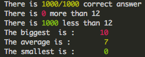
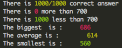
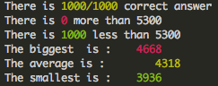

# 42-push_swap
Because swap_push isn't as natural

Given a set of integers, sort it using a predefined set of instructions using
two stacks. The instruction set is defined below. This program outputs a program
in push_swap instructions that sorts the input integers.

## Instruction set
For the following instructions, if the instruction is not possible, the part of
it that can't be executed won't.

Code	| Instruction		| Action
--------|-----------------------|----------------------------------------------
`sa`	| swap a		| swaps the 2 top elements of stack a
`sb`	| swap b		| swaps the 2 top elements of stack b
`ss`	| swap a + swap b	| both `sa` and `sb`
`pa`	| push a		| moves the top element of stack b at the top of stack a
`pb`	| push b		| moves the top element of stack a at the top of stack b
`ra`	| rotate a		| shifts all elements of stack a from bottom to top
`rb`	| rotate b		| shifts all elements of stack b from bottom to top
`rr`	| rotate a + rotate b	| both `ra` and `rb`
`rra`	| reverse rotate a	| shifts all elements of stack a from top to bottom
`rrb`	| reverse rotate b	| shifts all elements of stack b from top to bottom
`rrr`	| reverse rotate a + reverse rotate b	| both `rra` and `rrb`

## Compiling
1. Run `make`
2. Then run `make submod_init`

## Running
```
./push_swap 1 2 3 4
./checker 1 2 3 4
```
```
./push_swap 1 2 3 4 | ./checker 1 2 3 4
```
```
ARG="1 2 3 4"
./push_swap $ARG | ./checker $ARG
```
```
/*Generates 100 values from 1 to 100 */
ARG=$(ruby -e "puts (1..100).to_a.shuffle.join(' ')")
./push_swap $ARG | ./checker $ARG
```

## Options
```
Usage   ./push_swap [-h] $ARG [-f] [*.txt]
——————
-h      [Help] displays this help
-f      [File] writes movements to *.txt file (if specified)
        If no output file is specified, the file will be output.txt

Usage   ./checker [-h] $ARG [-lscfv] [*.txt]
——————
-h      [Help] displays this help
-l      [Lines] displays the number of movements
-s      [Steps] displays details of each stack
-c      [Color] displays only last movement (desactivated with -s)
-f      [File] reads movements from a *.txt file which is specified
-v      [Viewer] displays a graphical viewer
——————
Viewer  [KEY_UP] Next move
Viewer  [KEY_DOWN] Previous move
Viewer  [PAGE_UP] Speed up
Viewer  [PAGE_DOWN] Speed down
Viewer  [ESC] Quit
```

## Scripts
### Running
1. run `./tester.sh`
2. or run `./analyser.sh` made by @roulinalexandre

### Performances with analyser.sh
Random values | Goal            | Performances
--------------|-----------------|-------------
5 random values | 12 or less    | 
100 random values | 700 or less | 
500 random values | 5300 or less | 


